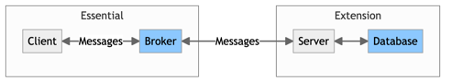

# List of Figures
1. Chapter 1 Introduction and Background Research
   * FIGURE X
   * Figure X
1. Chapter 2 Methods
   * [Figure 2.A - High Level Solution Definition, with component interactions](#figure-2a)
   * [Figure 2.B](#figure-2b)
   * [Figure 2.C - Server application view of messaging structure](#figure-2c)
   * [Figure 2.D](#figure-2d)
   * 

# Figures

### Figure 2.A

### Figure 2.B

### Figure 2.C

### Figure 2.D