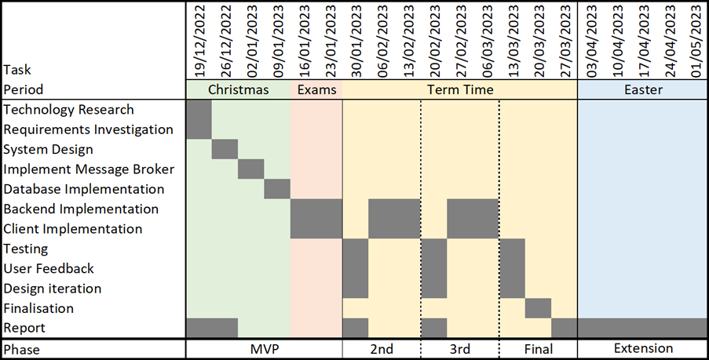

# Table of Figures

- [Figure 2.1](#figure-21) - High Level Solution Definition, with component interactions
- [Figure 2.2](#Figure-22) - UML Component Diagram
- [Figure 2.3](#Figure-23) - UML Class Diagram of Messages
- [Figure 2.4](#Figure-24) - UML Class Diagram of Additional Project Models
- [Figure 2.5](#Figure-25) - UML Class Diagram of Logging Models
- [Figure 2.6](#Figure-26) - UML Class Diagram of Publishers
- [Figure 2.7](#Figure-27) - UML Class Diagram of Persistent Database Data Classes
- [Figure 2.8](#Figure-28) - Client unit view of messaging structure
- [Figure 2.9](#Figure-29) - Server application view of messaging structure
- [Figure 2.10](#Figure-210) - UML Class Diagram of Complete Project
- [Figure 2.11](#Figure-211) - UML Sequence Diagram of Basic Operation Message Flow
- [Figure 2.12](#Figure-212) - UML Sequence Diagram of AUTH Operation
- [Figure 2.13](#Figure-213) - UML Sequence Diagram of HOST Operation
- [Figure 2.14](#Figure-214) - UML Sequence Diagram of Failed Message Publish
- [Figure 2.15](#Figure-215) - UML Sequence Diagram of Failed Message Resend Mechanism

##### Appendices
- [Figure C.1](#Figure-c1) - Gantt Chart of Planned Project Timeline
- [Figure C.2](#Figure-c2) - Gantt Chart of Actual Project Timeline
- [Figure C.3](#Figure-c3) - Screenshot of Git History

###### Figure 2.1

###### Figure 2.2

###### Figure 2.3

###### Figure 2.4

###### Figure 2.5

###### Figure 2.6

###### Figure 2.7

###### Figure 2.8

###### Figure 2.9

###### Figure 2.10

###### Figure 2.11

###### Figure 2.12

###### Figure 2.13

###### Figure 2.14

###### Figure 2.15

###### Figure C.1

###### Figure C.2

###### Figure C.3
